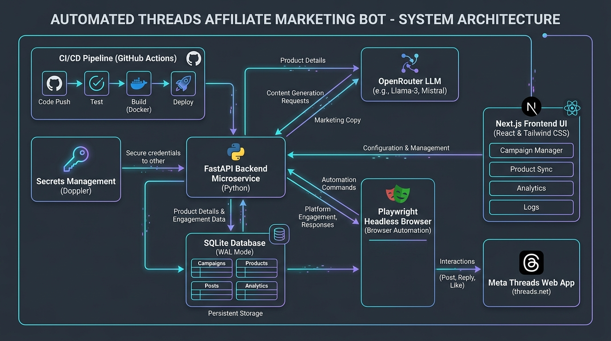
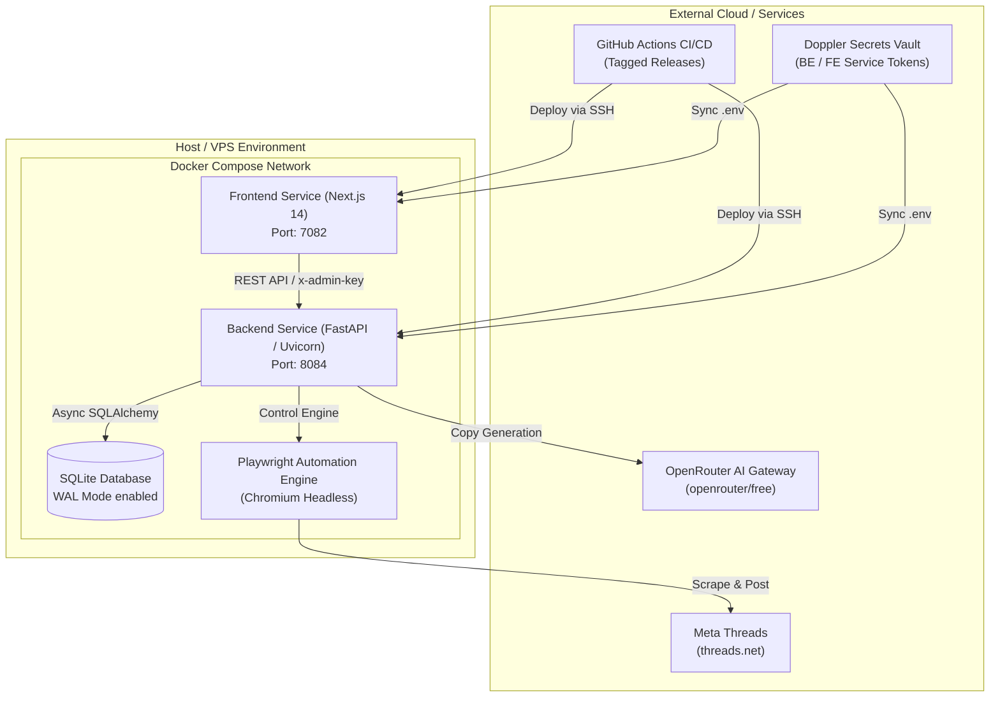
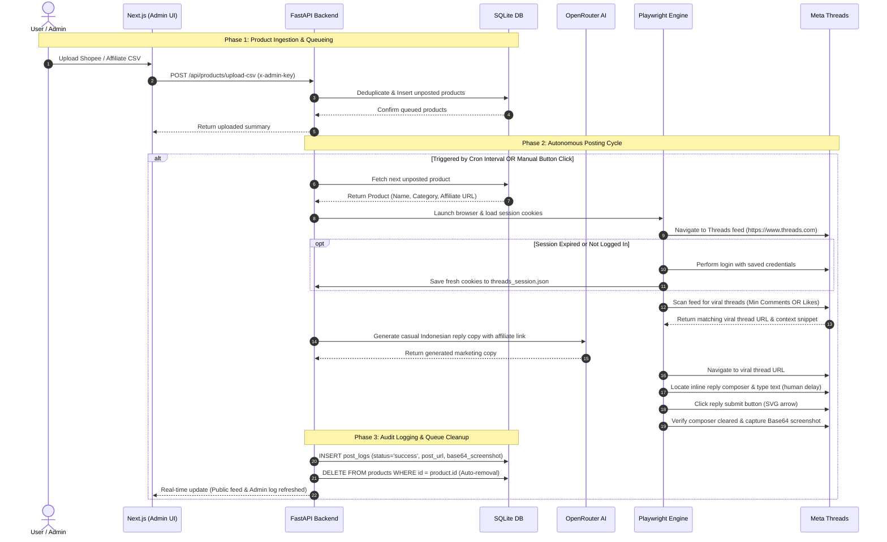
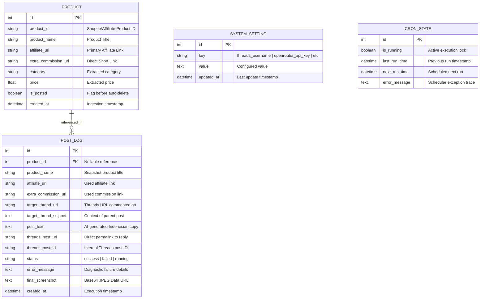
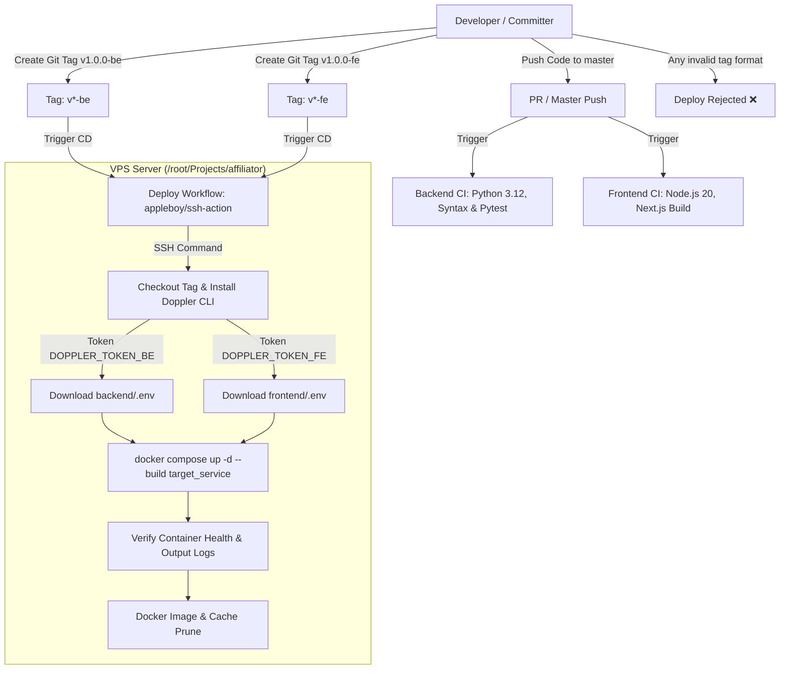

# System Architecture & High-Level Design Flow 🏗️

This document details the architectural design, core subsystems, data models, and end-to-end execution flow of the **Autonomous Threads Affiliate Marketing Bot**.

---

## 1. High-Level Architecture Overview

The platform is designed as a decoupled, asynchronous multi-tier architecture with zero external database dependencies:

---

## 2. Core Architectural Subsystems

### 2.1. Next.js Frontend UI (Port 7082)
- **Public Audit Feed (`/`)**: Read-only public dashboard showing the timeline of posted affiliate threads, status badges, generated Indonesian promotional copy, direct Threads reply links, and full Base64 screenshot modal previews without authentication.
- **Admin Portal (`/admin`)**: Protected by `x-admin-key` authentication. Provides:
  - CSV/TSV product upload with Shopee affiliate link deduplication.
  - Manual queue control and "Post Next Item Now" execution.
  - System configuration (Threads credentials, OpenRouter API keys, viral criteria thresholds, posting intervals).
  - Real-time step-by-step agent debug logs.
- **Client Architecture**: Next.js 14 App Router, React 18, Tailwind CSS, Lucide icons, and zero-storage Base64 Data URL image rendering.

### 2.2. FastAPI Backend Microservice (Port 8084)
- **Asynchronous Execution**: Fully async architecture powered by `asyncio`, `aiosqlite`, `httpx`, and `APScheduler`.
- **Domain Routers**:
  - `/api/products`: Queue operations (upload CSV, list, delete, bulk delete).
  - `/api/logs`: Audit logs retrieval and log clearing.
  - `/api/cron`: Background scheduler state management, manual trigger, interval adjustments.
  - `/api/settings`: Database-persisted configuration management.
  - `/api/health`: Container health check probe.
- **Security & Authorization**: Protected routes enforce `x-admin-key` header validation against database settings with fallback to `.env` (`X_ADMIN_KEY`).

### 2.3. SQLite with WAL Persistence Layer
- Stored on host-mounted volume `./backend/data/affiliate.db`.
- Operates in **Write-Ahead Logging (WAL)** mode for concurrent read/write transactions without table locking during Playwright execution.
- **Zero-Storage Screenshot Optimization**: Screenshots are captured as compressed in-memory JPEG bytes (`quality=65`) and stored as Base64 Data URLs (`data:image/jpeg;base64,...`) directly in the database. No raw image files are persisted on disk.

### 2.4. Playwright Browser Automation Engine
- Utilizes Microsoft Playwright Chromium (`mcr.microsoft.com/playwright/python:v1.62.0-noble`).
- **Session Persistence**: Saves authentication cookies into `backend/data/sessions/threads_session.json` upon initial login; subsequent runs reuse existing session cookies to bypass two-factor challenges and rate limits.
- **Targeted DOM Automation**: Uses synthetic human typing delays (`delay=15ms`) to properly populate Meta Threads' Lexical editor state, targeting the rotated 90-degree arrow SVG reply button (`div[role="button"][aria-label="Reply"]`).
- **Submission Guarantee**: Performs strict verification by monitoring that the composer textarea clears completely (`innerText == ""`) within an 8-second window.

### 2.5. Doppler Configuration & Environment Isolation
- Adheres to the **Strict Zero-Hardcoded Environment Values Standard**.
- All environment configurations (`DATABASE_URL`, `PORT`, `X_ADMIN_KEY`, `NEXT_PUBLIC_API_URL`) reside exclusively in `.env` files managed by Doppler.
- Docker Compose, Dockerfiles, and GitHub Actions contain zero hardcoded ports, passwords, or connection strings.

---

## 3. High-Level Design Flow (End-to-End Lifecycle)

The complete lifecycle from product upload to social posting and automatic queue cleanup:

---

## 4. Database Schema Design

The SQLite database comprises 4 core tables:

---

## 5. CI/CD & Deployment Architecture

### Tag Conventions
- `vX.Y.Z-be`: Triggers deployment of the **FastAPI Backend** service.
- `vX.Y.Z-fe`: Triggers deployment of the **Next.js Frontend** service.
- **Strict Format Enforced**: Tags outside `^v[0-9]+\.[0-9]+\.[0-9]+-(be|fe)$` automatically terminate the GitHub Action with an exit code of 1.

---

## 6. Security & Operational Guardrails

1. **Strict Zero-Hardcoded Environment Values**:
   - Secrets, ports, credentials, and connection strings are strictly read from `.env` and Doppler.
   - Zero fallback strings or default values exist in code or YAML manifests.
2. **Rate-Limit & Anti-Spam Mitigation**:
   - APScheduler enforces minimum wait times between automated replies.
   - Configurable jitter delays randomize execution timestamps.
   - Playwright mimics human typing with natural character delays.
3. **Queue Integrity Guarantee**:
   - Products are deleted from the active queue only upon verified reply publication (`innerText == ""`).
   - If an error occurs (e.g. network failure, rate limit), the product remains safely in the queue for the next retry.
