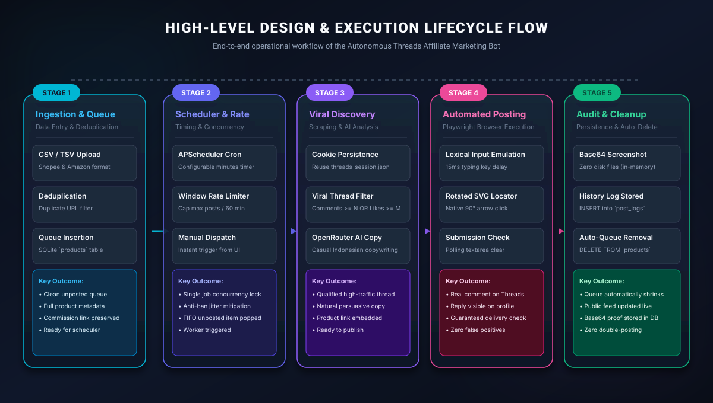
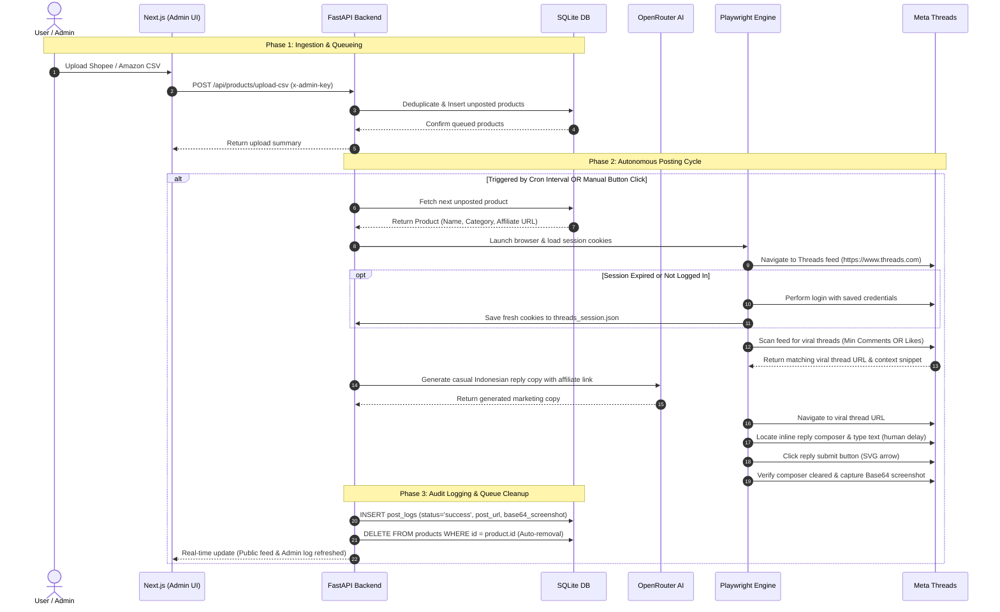
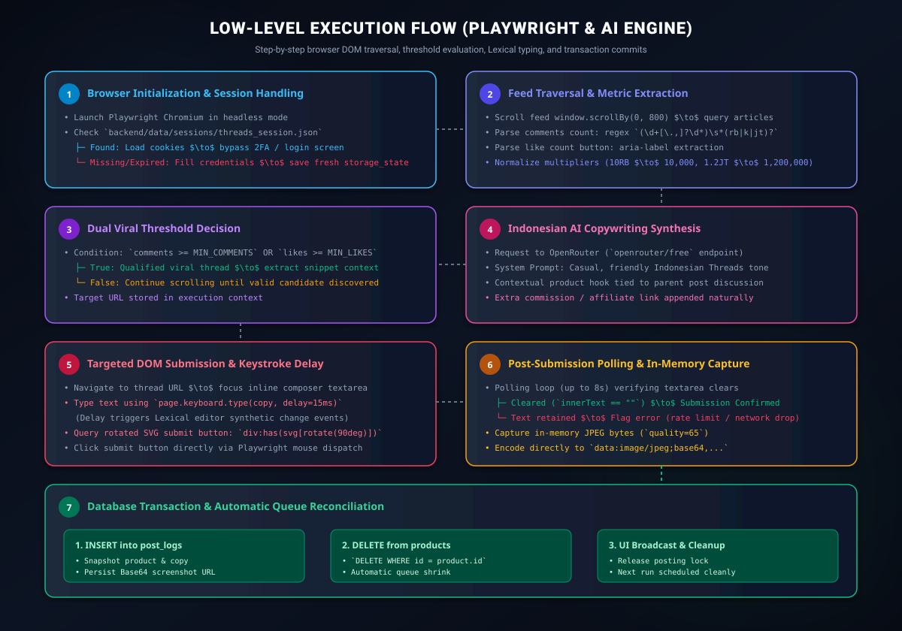
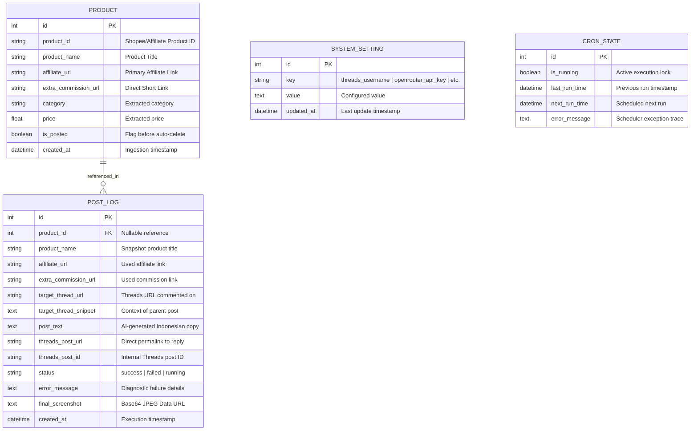
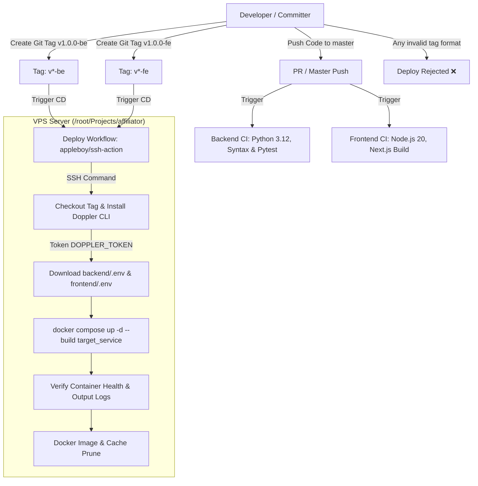

# System Architecture, High-Level & Low-Level Design Flows 🏗️

This document details the architectural design, core subsystems, high-level operational lifecycle, low-level browser automation flow, and data persistence models of the **Autonomous Threads Affiliate Marketing Bot**.

---

## 1. System Architecture Overview

The platform is designed as a decoupled, multi-tier asynchronous architecture with zero external database dependencies:


### Subsystem Architecture Diagram

```mermaid
graph TB
    subgraph "External Cloud / Services"
        GH["GitHub Actions CI/CD<br/>(Tagged Releases: v*-be, v*-fe)"]
        DOPPLER["Doppler Secrets Vault<br/>(DOPPLER_TOKEN)"]
        OPENROUTER["OpenRouter AI Gateway<br/>(openrouter/free)"]
        THREADS["Meta Threads<br/>(threads.net)"]
    end

    subgraph "Host / VPS Server (/root/Projects/affiliator)"
        subgraph "Public Interface"
            FE["Frontend Service (Next.js 14)<br/>Public Port: 7082 (Exposed)"]
        end
        subgraph "Internal Docker Network (Private)"
            BE["Backend Service (FastAPI / Uvicorn)<br/>Internal Port: 8084 (Private / Unexposed)"]
            DB[("SQLite Database<br/>WAL Mode enabled")]
            PLAYWRIGHT["Playwright Automation Engine<br/>(Chromium Headless)"]
        end
    end

    GH -->|Deploy via SSH| FE
    GH -->|Deploy via SSH| BE
    DOPPLER -->|Sync backend/.env| BE
    DOPPLER -->|Sync frontend/.env| FE

    FE -->|Next.js Reverse Proxy (/api/*)<br/>INTERNAL_API_URL| BE
    BE -->|Async SQLAlchemy| DB
    BE -->|Copy Generation| OPENROUTER
    BE -->|Browser Automation| PLAYWRIGHT
    PLAYWRIGHT -->|Scrape Feed & Post Reply| THREADS
```

### Core Architecture Components

1. **Next.js 14 Frontend UI & Reverse Proxy (Public Port 7082)**:
   - **Single Public Port Model**: Only port `7082` is exposed to the host / public network. The browser communicates solely with `http://<host>:7082`.
   - **Built-in Reverse Proxy (`rewrites`)**: All API calls (`/api/*`) are proxied server-side by Next.js to the backend microservice via `INTERNAL_API_URL` (`http://backend:8084`). This eliminates CORS entirely and conceals the backend from external access.
   - **Public Audit Feed (`/`)**: Read-only public dashboard showing the timeline of posted affiliate threads, status badges, generated Indonesian promotional copy, direct Threads reply links, and full Base64 screenshot modal previews without authentication.
   - **Admin Portal (`/admin`)**: Protected by `x-admin-key` header authentication. Provides:
     - CSV/TSV product upload with Shopee affiliate link deduplication.
     - Manual queue control and "Post Next Item Now" execution.
     - System configuration (Threads credentials, OpenRouter API keys, viral criteria thresholds, posting intervals).
     - Real-time step-by-step agent debug logs.
   - **Client Architecture**: Next.js 14 App Router, React 18, Tailwind CSS, Lucide icons, and zero-storage Base64 Data URL image rendering.

2. **FastAPI Backend Microservice (Private Internal Port 8084)**:
   - **Fully Isolated Network**: Backend does NOT publish any ports to the host (`ports:` omitted in `docker-compose.yml`). Accessible exclusively inside Docker network.
   - **Asynchronous Execution**: Fully async architecture powered by `asyncio`, `aiosqlite`, `httpx`, and `APScheduler`.
   - **Domain Routers**:
     - `/api/products`: Queue operations (upload CSV, list, delete, bulk delete).
     - `/api/logs`: Audit logs retrieval and log clearing.
     - `/api/cron`: Background scheduler state management, manual trigger, interval adjustments.
     - `/api/settings`: Database-persisted configuration management.
     - `/api/health`: Container health check probe.
   - **Security & Authorization**: Protected routes enforce `x-admin-key` header validation against database settings with fallback to `.env` (`X_ADMIN_KEY`).

3. **SQLite Persistence with WAL Mode**:
   - Host-mounted volume `./backend/data/affiliate.db`.
   - Operates in **Write-Ahead Logging (WAL)** mode for concurrent non-blocking reads and writes during background automation.
   - **Zero-Disk Screenshot Storage**: Screenshots are captured as compressed in-memory JPEG bytes (`quality=65`) and stored directly as Base64 Data URLs (`data:image/jpeg;base64,...`) in SQLite. No raw image files are written to the host filesystem.

4. **Playwright Automation Engine (Chromium)**:
   - Headless Chromium runtime (`mcr.microsoft.com/playwright/python:v1.62.0-noble`).
   - Cookie reuse via `backend/data/sessions/threads_session.json` to bypass recurring logins and 2FA.
   - Precise DOM locators targeting Meta Threads' rotated SVG reply button with post-submission verification.

5. **Doppler & Environment Isolation**:
   - Adheres strictly to the **Zero-Hardcoded Environment Values Standard**.
   - No hardcoded ports, passwords, or connection strings in source code or YAML manifests.

---

## 2. High-Level Design Flow (System Lifecycle)

The high-level operational lifecycle describes how products enter the system, get processed by the autonomous scheduler, qualify against engagement criteria, and post to Meta Threads:



### High-Level Sequence Diagram



### The 5 Lifecycle Stages

1. **Stage 1: Product Ingestion & Queueing**:
   - Product CSV/TSV is uploaded via the Admin Portal (`/admin`).
   - The backend validates columns (`product_name`, `affiliate_url`, optional `extra_commission_url`).
   - Deduplicates incoming URLs against existing entries in SQLite.
   - Inserts new rows with `is_posted = False`.
2. **Stage 2: Scheduling & Rate Limiting**:
   - APScheduler triggers the posting worker at regular intervals (configured in Admin Settings).
   - Sliding window limiter enforces max posts per hour (preventing platform rate limits).
   - Concurrency lock (`is_currently_posting`) ensures only one browser session executes at a time.
3. **Stage 3: Viral Thread Discovery**:
   - Playwright loads existing session cookies from `threads_session.json` to access the personalized feed.
   - If session has expired, it automatically navigates to `/login`, authenticates, and persists fresh cookies.
   - Evaluates discussions against dual criteria: `(Comments >= MIN_COMMENTS) OR (Likes >= MIN_LIKES)`.
4. **Stage 4: AI Copy Generation & Reply Posting**:
   - OpenRouter generates conversational, high-converting Indonesian copy matching the parent thread's topic.
   - Appends the affiliate/extra commission link organically.
   - Types copy into the inline composer with human-like keystroke delays.
   - Submits via the rotated 90-degree SVG arrow button.
5. **Stage 5: Audit Persistence & Automatic Queue Removal**:
   - Captures an in-memory JPEG screenshot and encodes it as Base64.
   - Records an immutable entry in `post_logs`.
   - **Deletes the product row from `products`** so it is never double-posted.
   - Broadcasts updated status to the Next.js frontend feed.

---

## 3. Low-Level Execution Flow (Playwright & Engine Mechanics)

The low-level execution flow details the exact DOM queries, regex parsers, keystroke event simulation, and transactional guarantees executed during each automated posting cycle:



### Detailed Low-Level Step-by-Step Breakdown

```mermaid
flowchart TD
    START([Start Worker Job]) --> READ_DB[(Read Product & Settings from DB)]
    READ_DB --> LAUNCH_PW[Launch Playwright Chromium Headless]
    
    LAUNCH_PW --> CHECK_COOKIE{Check threads_session.json}
    CHECK_COOKIE -->|Exists| LOAD_COOKIE[Load Storage State Context]
    CHECK_COOKIE -->|Missing / Expired| LOGIN[Navigate to /login -> Type Creds -> Save cookies]
    
    LOAD_COOKIE --> NAV_FEED[Navigate to https://www.threads.com]
    LOGIN --> NAV_FEED
    
    NAV_FEED --> SCROLL[Scroll Feed window.scrollBy 0, 800]
    SCROLL --> PARSE_DOM[Query Post Containers div data-pressable-container]
    
    PARSE_DOM --> EXTRACT_METRICS["Parse Comments & Likes<br/>Regex: (\\d+[\\.,]?\\d*)\\s*(rb|k|jt)?"]
    EXTRACT_METRICS --> EVAL_VIRAL{"(Comments >= MIN) OR<br/>(Likes >= MIN)?"}
    
    EVAL_VIRAL -->|No| SCROLL
    EVAL_VIRAL -->|Yes| EXTRACT_CONTEXT[Extract Parent Post Snippet & Permalinks]
    
    EXTRACT_CONTEXT --> OPENROUTER_CALL["Call OpenRouter API (openrouter/free)<br/>System Prompt: Casual Indonesian Copy"]
    OPENROUTER_CALL --> RECEIVE_COPY[Receive Copy with Affiliate URL]
    
    RECEIVE_COPY --> NAV_THREAD[Navigate to Target Thread URL]
    NAV_THREAD --> FOCUS_EDITOR["Locate div[contenteditable='true'][role='textbox']"]
    FOCUS_EDITOR --> TYPE_KEYBOARD["page.keyboard.type(copy, delay=15ms)<br/>(Fires Lexical Editor Synthetic Events)"]
    
    TYPE_KEYBOARD --> FIND_BTN["Query Rotated SVG Button<br/>div[role='button']:has(svg[style*='rotate(90deg)'])"]
    FIND_BTN --> CLICK_BTN[Click Submit Reply Button]
    
    CLICK_BTN --> POLL_CLEAR{"Polling (up to 8s):<br/>Is innerText.strip() == ''?"}
    POLL_CLEAR -->|No / Timeout| FAIL_POST[Record Error in Log -> Product Kept in Queue]
    POLL_CLEAR -->|Yes / Cleared| CAPTURE_SS["Capture page.screenshot(type='jpeg', quality=65)<br/>Direct to Base64 Data URL"]
    
    CAPTURE_SS --> DB_TRANS["Begin Database Transaction:<br/>1. INSERT post_logs<br/>2. DELETE FROM products WHERE id=product.id"]
    DB_TRANS --> COMMIT[Commit Transaction & Close Browser]
    COMMIT --> END([Finish Job Successfully])
    FAIL_POST --> END
```



### Technical Implementation Details

#### 1. Metric Parsing & Normalization
Threads displays engagement counts in localized shorthand formats (e.g. `12 balasan`, `1,5 rb suka`, `10K likes`, `1,2 jt balasan`). The engine uses robust regex normalization:
```python
# Multiplier conversion table:
# 'rb' / 'k' -> value * 1,000
# 'jt' / 'm' -> value * 1,000,000
```

#### 2. Lexical Editor Keystroke Emulation
Meta Threads uses Facebook's **Lexical** rich-text framework. Directly modifying `.innerText` or using rapid `.fill()` bypasses Lexical's internal state reconciler, leaving the submit button disabled:
```python
# Focus and type with synthetic delay to trigger React/Lexical keystroke handlers:
await reply_box.click()
await page.keyboard.type(post_text, delay=15)
```

#### 3. Rotated SVG Submit Button Discovery
The submit button in Threads' web composer does not contain textual labels like "Post" or "Reply". Instead, it is rendered as:
```html
<div role="button" aria-label="Reply">
  <svg style="--x-transform: rotate(90deg);">...</svg>
</div>
```
The Playwright engine targets this exact DOM signature to trigger submission without relying on brittle localized text selectors.

#### 4. Post-Submission Clearing Verification
To prevent false-positive reporting when rate-limited or blocked, the engine polls the editor for up to 8 seconds. Upon successful acceptance by Threads' backend, Lexical clears the editor:
```python
is_cleared = False
for _ in range(16):
    await asyncio.sleep(0.5)
    content = await reply_box.inner_text()
    if content.strip() == "":
        is_cleared = True
        break
```

---

## 4. Database Schema Design

The SQLite database uses 4 relational tables:



---

## 5. CI/CD & Tagged Deployment Architecture



### Release Tagging Conventions
- `vX.Y.Z-be` $\rightarrow$ Deploys the **FastAPI Backend** service.
- `vX.Y.Z-fe` $\rightarrow$ Deploys the **Next.js Frontend** service.
- Tags outside `^v[0-9]+\.[0-9]+\.[0-9]+-(be|fe)$` are strictly rejected by the pipeline.

---

## 6. Security & Operational Guardrails

1. **Strict Zero-Hardcoded Environment Values**:
   - Connection strings, ports, credentials, and API URLs are strictly loaded from `.env` (or Doppler in production).
   - Zero fallback strings or default values exist in code or YAML manifests.
2. **Rate-Limit & Anti-Spam Mitigation**:
   - APScheduler enforces minimum wait times between automated replies.
   - Configurable jitter delays randomize execution timestamps.
   - Playwright mimics human typing with natural character delays.
3. **Queue Integrity Guarantee**:
   - Products are deleted from the active queue only upon verified reply publication (`innerText == ""`).
   - If an error occurs (e.g. network failure, rate limit), the product remains safely in the queue for the next retry.
